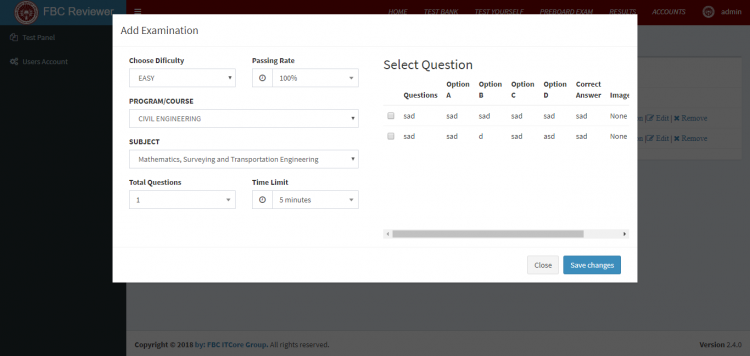

# Online Reviewer System Using PHP/PDO

### Description

This Online Reviewer System was developed using PHP/PDO, HTML, CSS, Javascript (Ajax and jQuery), and AdminLTE Template. This project is the best for knowledge evaluation and it’s suitable for college and university. This system provides a comprehensive list of all of the reviews that were written by the teacher or admin.

### Features

<ul>
  <li><strong>Admin Side</strong> <strong>Test Bank</strong>
    <ul>
      <li>Manage Questions</li>
    </ul>
  </li>
  <li><strong>Test Your Self</strong>
    <ul>
      <li>Add Examination</li>
      <li>View Question</li>
      <li>Edit Examination</li>
      <li>Remove</li>
    </ul>
  </li>
  <li><strong>Pre Board Exam</strong>
    <ul>
      <li>Add Examination</li>
      <li>View Question</li>
      <li>Edit Examination</li>
      <li>Remove</li>
    </ul>
  </li>
  <li><strong>Result</strong> <strong>Manage User Accounts</strong> <strong>Student</strong>
    <ul>
      <li>Pre Test</li>
      <li>Take Exam</li>
      <li>Pre Board Exam</li>
      <li>Take Exam</li>
      <li>Result</li>
    </ul>
  </li>
  <li><strong>Login and Logout</strong></li>
</ul>

Visit [sourcecodester.com](https://www.sourcecodester.com/php/12937/online-reviewer-system-using-phppdo.html) for more detailed information about this project.

### Website Info

| Title | Online Reviewer System Using PHP/PDO with Source Code |
|:---|:---|
| Website | [www.sourcecodester.com](https://www.sourcecodester.com) |
| Link | https://www.sourcecodester.com/php/12937/online-reviewer-system-using-phppdo.html |
| Language | PHP |
| Developer/Uploader | [janobe](https://www.sourcecodester.com/users/janobe) |
